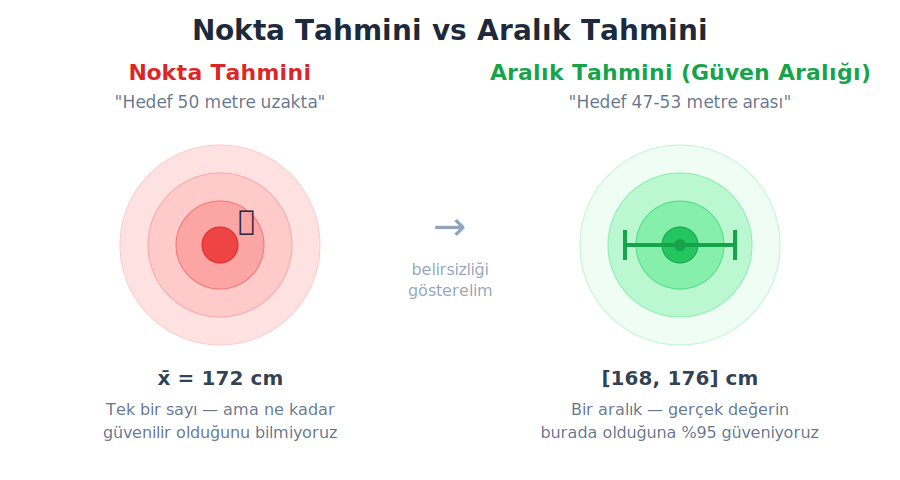
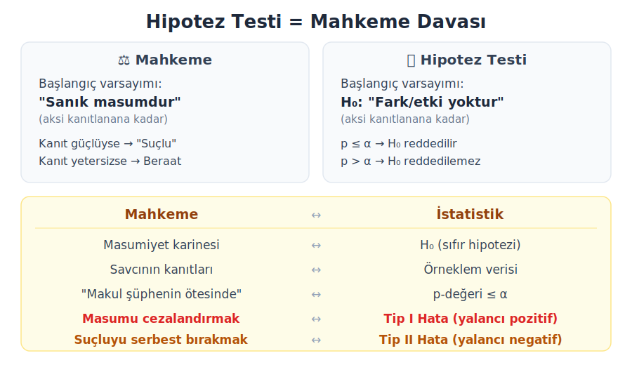
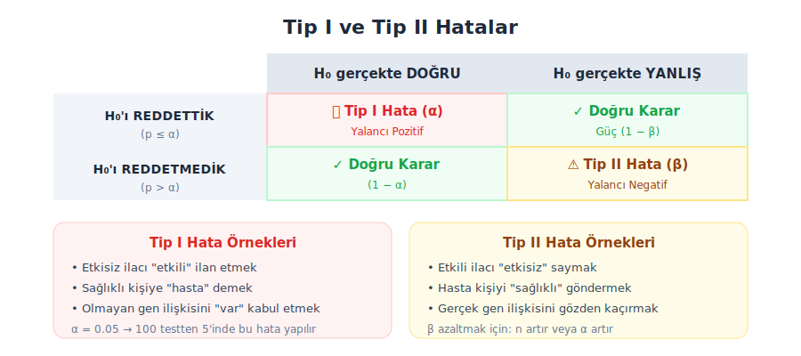

## Özet

* Nokta tahmini vs aralık tahmini
* Güven aralığı nedir ve nasıl yorumlanır?
* Güven aralığını etkileyen faktörler
* R ile güven aralığı hesaplama
* Hipotez testi mantığı — mahkeme analojisi
* H₀ ve H₁ hipotezleri
* P-değeri ve anlamlılık düzeyi
* Tip I ve Tip II hatalar
* R ile hipotez testi uygulaması

# Güven Aralıkları

## Bir anket sonucu gördünüz...

Haberlerde şöyle bir cümle okuduğunuzu düşünün:

> "Seçim anketine göre Aday A'nın oy oranı **%48 ± 3** olarak ölçülmüştür."

Bu ne anlama geliyor?

* Nokta tahmini: %48
* Hata payı: ± 3
* Aralık: %45 ile %51 arası

Gerçek oy oranının bu aralıkta olduğuna belirli bir güvenle inanıyoruz. Ama **ne kadar** güvenle? İşte güven aralığı kavramı burada devreye giriyor.

## Neden tek bir sayı yetmez?

Bir araştırmacı olarak popülasyonu (evreni) incelemek istiyorsunuz ama bunu tamamı üzerinde yapamazsınız. Örneklem alırsınız.

* **Popülasyon parametresi (μ)**: Gerçek değer — tüm Türkiye'deki yetişkin erkeklerin ortalama boyu. Bilinmez.
* **Örneklem istatistiği (x̄)**: 100 kişi ölçtünüz, ortalama 172 cm çıktı. Bu bir tahmindir.

Sorun şu: farklı 100 kişi seçseydiniz, belki 174 cm, belki 170 cm çıkardı. Her örneklem farklı bir x̄ verir.

Tek bir sayı (172 cm) vermek yerine **belirsizliği de göstermek** daha dürüsttür.

## Nokta tahmini vs aralık tahmini

{.nostretch fig-align="center" width="85%"}

## Güven aralığı nedir?

Güven aralığı, örneklem verisinden hesaplanan ve bilinmeyen popülasyon parametresini belirli bir olasılıkla içerdiği düşünülen bir değer aralığıdır.

**Genel formül:**

$$ \text{Güven Aralığı} = \text{Nokta Tahmini} \pm \text{Hata Payı} $$

Ortalama için:

$$ \bar{x} \pm t_{\alpha/2,\; n-1} \times \frac{s}{\sqrt{n}} $$

* $\bar{x}$: Örneklem ortalaması
* $s$: Örneklem standart sapması
* $n$: Örneklem büyüklüğü
* $\frac{s}{\sqrt{n}}$: **Standart hata** (SE) — ortalamanın ne kadar değişkenlik gösterdiği
* $t_{\alpha/2, n-1}$: t-kritik değeri (güven düzeyine bağlı)

## Dikkat: Yaygın yanlış yorum!

> ❌ "%95 güven aralığı, gerçek ortalamanın %95 olasılıkla bu aralıkta olduğu anlamına gelir."

Bu **yanlıştır**! Gerçek ortalama (μ) sabit bir sayıdır, rastgele değildir. Ya aralıkta ya da değil.

> ✓ "Bu yöntemi tekrar tekrar uygulasak, oluşturduğumuz aralıkların %95'i gerçek ortalamayı içerir."

Yani güven, aralığa değil **yönteme** aittir. 100 farklı örneklem alsak ve her birinden %95 güven aralığı hesaplasak, bunların yaklaşık 95 tanesi μ'yü içerir, 5 tanesi içermez.

## Güven aralığını etkileyen 3 faktör

**1. Güven düzeyi (↑ = aralık genişler)**

%95'ten %99'a çıkarsak daha "emin" olmak istiyoruz → daha geniş aralık gerekir.

**2. Örneklem büyüklüğü (↑ = aralık daralır)**

Daha çok veri toplamak → daha hassas tahmin → daha dar aralık. Formüldeki $\sqrt{n}$ paydada olduğu için n artınca SE azalır.

**3. Verinin değişkenliği, standart sapma (↑ = aralık genişler)**

Veriler çok dağınıksa (s büyük) → belirsizlik fazla → daha geniş aralık.

## Güven aralığının daralması — simülasyon

```{r}
#| output-location: slide
#| echo: true

# Örneklem büyüklüğü arttıkça güven aralığı nasıl daralır?
set.seed(42)
populasyon <- rnorm(10000, mean = 170, sd = 8)  # Boy (cm)

n_degerleri <- c(10, 30, 50, 100, 500)
plot(NULL, xlim = c(0, 6), ylim = c(166, 174),
     xlab = "", ylab = "Güven Aralığı (cm)", xaxt = "n",
     main = "Örneklem büyüklüğü arttıkça güven aralığı daralır")

for(i in 1:length(n_degerleri)) {
  orneklem <- sample(populasyon, n_degerleri[i])
  ci <- t.test(orneklem)$conf.int
  segments(i, ci[1], i, ci[2], lwd = 3, col = "steelblue")
  points(i, mean(orneklem), pch = 19, col = "red", cex = 1.5)
}
axis(1, at = 1:5, labels = paste("n =", n_degerleri))
abline(h = 170, col = "red", lty = 2)
text(5.5, 170.3, "μ = 170", col = "red", cex = 0.9)
```

## 

```{r}
#| output-location: slide
#| echo: true
#| fig-height: 7

# Aynı popülasyondan 100 kez 50'şer kişilik örneklem al
set.seed(123)
n <- 50
tekrar <- 100

plot(NULL, xlim = c(166, 174), ylim = c(0, tekrar + 1),
     xlab = "Boy (cm)", ylab = "Örneklem #", yaxt = "n",
     main = "100 farklı örneklemden %95 güven aralıkları")

disarda <- 0
for(i in 1:tekrar) {
  orneklem <- sample(populasyon, n)
  ci <- t.test(orneklem)$conf.int
  ort <- mean(orneklem)
  
  # μ=170 aralık dışında mı?
  renk <- ifelse(ci[1] > 170 | ci[2] < 170, "red", "steelblue")
  if(renk == "red") disarda <- disarda + 1
  
  segments(ci[1], i, ci[2], i, lwd = 2, col = renk)
  points(ort, i, pch = 19, col = renk, cex = 0.8)
}

abline(v = 170, col = "red", lty = 2, lwd = 2)
text(170, tekrar + 1, paste("μ = 170"), col = "red", cex = 0.9)
text(172.5, tekrar + 1, paste(disarda, "/ 50 aralık μ'yü içermiyor"), 
     col = "red", cex = 0.9)
```

## R ile güven aralığı hesaplama

```{webr-r}
# Kedilerde vücut ağırlığı için %95 güven aralığı
library(MASS)
data(cats)

# t.test fonksiyonu güven aralığını otomatik hesaplar
sonuc <- t.test(cats$Bwt)
print(sonuc)
```

## Güven aralığının yorumlanması

```{webr-r}
library(MASS)
sonuc <- t.test(cats$Bwt)

cat("Örneklem ortalaması:", round(sonuc$estimate, 3), "kg\n")
cat("%95 Güven Aralığı: [", round(sonuc$conf.int[1], 3), ",",
    round(sonuc$conf.int[2], 3), "] kg\n\n")

# %99 güven aralığı ile karşılaştır
sonuc99 <- t.test(cats$Bwt, conf.level = 0.99)
cat("%99 Güven Aralığı: [", round(sonuc99$conf.int[1], 3), ",",
    round(sonuc99$conf.int[2], 3), "] kg\n")
cat("\nGüven düzeyi arttı → aralık genişledi\n")
```

# Hipotez Testi

## Bir soru 

Bir arkadaşınız madeni para ile yazı-tura atıyor. 20 kez atıyor ve **18 kez yazı** geliyor.

Sizce bu para hileli mi?

* Belki sadece şansızlık — %50 olasılıkla yazı gelen normal bir parayla da 18/20 yazı gelebilir... ama ne kadar olası?
* 20 atışta 18+ yazı gelme olasılığı: P = 0.0002 (%0.02)
* Bu kadar düşük bir olasılık → "Bu şans eseri değil, para hileli" deriz.

İşte hipotez testi tam olarak bu mantıkla çalışır: önce bir varsayım kur (*para adil*), sonra veriyi topla (*20 atış*), sonra sor — bu sonuç  ne kadar olası? Eğer çok düşük bir olasılıksa, varsayımını reddet.

## Hipotez testi 

{.nostretch fig-align="center" width="90%"}

## Sıfır ve alternatif hipotezler

Her hipotez testinde iki hipotez kurulur:

**H₀ (Sıfır hipotezi):** "Etki yoktur, fark yoktur, her şey normaldir." Masumiyet karinesi gibi — aksi kanıtlanana kadar geçerli.

**H₁ (Alternatif hipotez):** "Bir etki vardır, bir fark vardır." Araştırmacının kanıtlamaya çalıştığı iddia.

## Hipotez örnekleri

**Yeni gübre etkili mi?**

* H₀: μ = 5 ton/hektar (gübre verimi değiştirmiyor)
* H₁: μ > 5 ton/hektar (gübre verimi artırıyor)

**İlaç kan basıncını düşürüyor mu?**

* H₀: μ ≥ 140 mmHg (ilaç etkisiz)
* H₁: μ < 140 mmHg (ilaç düşürüyor)

**Gen mutasyonu hastalık riskini etkiliyor mu?**

* H₀: μ_hasta = μ_sağlıklı (fark yok)
* H₁: μ_hasta ≠ μ_sağlıklı (fark var)

## P-değeri nedir?

P-değeri şu soruya cevap verir:

> "H₀ doğru olsaydı, elimdeki veri kadar veya daha aşırı bir sonuç elde etme olasılığım ne kadardı?"

* **Küçük p-değeri** (p ≤ 0.05): "Bu veri, H₀ altında çok olası değil. H₀'a karşı güçlü kanıt." → H₀ reddedilir
* **Büyük p-değeri** (p > 0.05): "Bu veri, H₀ altında gayet olası. Kanıt yetersiz." → H₀ reddedilemez

> ⚠️ "H₀ reddedilemez" ile "H₀ doğrudur" aynı şey **değildir**! Mahkemede beraat etmek "masumiyetin kanıtlanması" değil, "suçluluğun kanıtlanamaması" demektir.

## P-değeri — para örneği ile

```{webr-r}
# 20 atışta 18 yazı gelmesi: para hileli mi?
# H0: p = 0.5 (adil para)
# H1: p != 0.5 (hileli para)

# Binom testi
binom.test(x = 18, n = 20, p = 0.5)
```

## Anlamlılık düzeyi (α)

α, H₀'ı yanlışlıkla reddetme riskimizin üst sınırıdır.

* α = 0.05 → 100 testten 5'inde yanlışlıkla "etki var" deme riski
* α = 0.01 → 100 testten 1'inde
* α = 0.10 → 100 testten 10'unda

**Karar kuralı basit:**

* p ≤ α → H₀ reddedilir → "İstatistiksel olarak anlamlı"
* p > α → H₀ reddedilemez → "Kanıt yetersiz"

α değeri testten **önce** belirlenmelidir. Veriyi gördükten sonra α'yı değiştirmek bilimsel olarak etik olmaz!

## Tip I ve Tip II hatalar

{.nostretch fig-align="center" width="90%"}

## Hipotez testi adımları — özet

1. **Hipotezleri kur:** H₀ ve H₁ belirle
2. **α seç:** Genellikle 0.05
3. **Veri topla ve test uygula:** Uygun istatistiksel testi seç
4. **P-değerini hesapla**
5. **Karar ver:** p ≤ α ise H₀ reddedilir
6. **Yorumla:** Biyolojik bağlamda ne anlama geliyor?

## Örnek: Tek örneklem t-testi

Araştırmacı, yeni bir bitkisel ilacın farelerde kan glikoz seviyesini referans değer olan 100 mg/dL'den farklılaştırıp farklılaştırmadığını test ediyor.

* H₀: μ = 100 mg/dL (ilaç etkisiz)
* H₁: μ ≠ 100 mg/dL (ilaç kan glikozunu değiştiriyor)
* α = 0.05

```{webr-r}
# 15 farenin kan glikoz değerleri (mg/dL)
glikoz <- c(92, 97, 94, 90, 89, 96, 91, 88, 93, 95, 89, 94, 91, 92, 90)

cat("Ortalama:", mean(glikoz), "mg/dL\n")
cat("Standart sapma:", round(sd(glikoz), 2), "\n\n")

# Tek örneklem t-testi
t.test(glikoz, mu = 100)
```

## Sonucun yorumlanması

```{webr-r}
glikoz <- c(92, 97, 94, 90, 89, 96, 91, 88, 93, 95, 89, 94, 91, 92, 90)
sonuc <- t.test(glikoz, mu = 100)

cat("t istatistiği:", round(sonuc$statistic, 2), "\n")
cat("Serbestlik derecesi:", sonuc$parameter, "\n")
cat("p-değeri:", format(sonuc$p.value, scientific = TRUE), "\n")
cat("95% Güven aralığı: [", round(sonuc$conf.int[1], 2), ",",
    round(sonuc$conf.int[2], 2), "]\n\n")

if(sonuc$p.value <= 0.05) {
  cat("Karar: p <= 0.05 → H0 REDDEDİLDİ\n")
  cat("İlaç, farelerin kan glikoz seviyesini anlamlı şekilde değiştiriyor.\n")
} else {
  cat("Karar: p > 0.05 → H0 reddedilemez\n")
}
```

## Görselleştirme

```{webr-r}
glikoz <- c(92, 97, 94, 90, 89, 96, 91, 88, 93, 95, 89, 94, 91, 92, 90)

boxplot(glikoz, main = "Farelerin Kan Glikoz Seviyeleri",
        ylab = "Glikoz (mg/dL)", col = "steelblue")
abline(h = 100, col = "red", lwd = 2, lty = 2)
text(1.3, 100.5, "H₀: μ = 100", col = "red", cex = 0.9)
```

## Güven aralığı ve hipotez testi bağlantısı

Bu iki kavram aslında aynı madalyonun iki yüzüdür:

* Eğer %95 güven aralığı H₀'daki değeri **içermiyorsa** → p < 0.05 → H₀ reddedilir
* Eğer %95 güven aralığı H₀'daki değeri **içeriyorsa** → p > 0.05 → H₀ reddedilemez

```{webr-r}
glikoz <- c(92, 97, 94, 90, 89, 96, 91, 88, 93, 95, 89, 94, 91, 92, 90)
sonuc <- t.test(glikoz, mu = 100)

cat("Güven aralığı: [", round(sonuc$conf.int[1], 2), ",",
    round(sonuc$conf.int[2], 2), "]\n")
cat("H₀ değeri (100) bu aralıkta mı?",
    ifelse(100 >= sonuc$conf.int[1] & 100 <= sonuc$conf.int[2],
           "EVET → H₀ reddedilemez", "HAYIR → H₀ reddedilir"), "\n")
```

## Soru

Bir araştırmacı, kedilerin ortalama vücut ağırlığının 2.5 kg olup olmadığını test etmek istiyor. `cats` veri setini kullanarak hipotezi kurunuz, tek örneklem t-testi uygulayınız ve sonucu yorumlayınız.

```{webr-r}
library(MASS)
data(cats)

# Çözümünüzü buraya yazıp çalıştırınız

```
