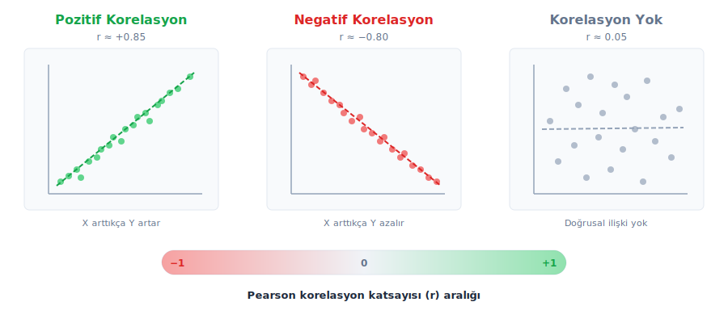
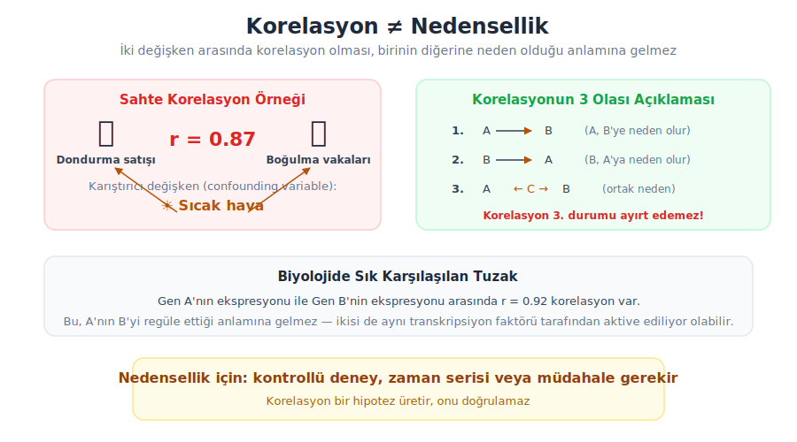
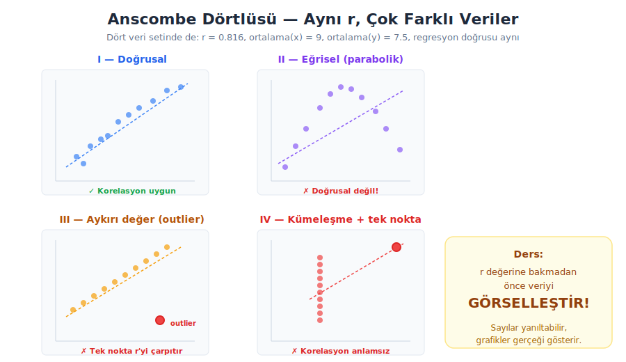

## Özet

* Korelasyon nedir?
* Korelasyon türleri
* Pearson korelasyon katsayısı
* Spearman korelasyon katsayısı
* Korelasyon ≠ Nedensellik
* Anscombe dörtlüsü
* Örnekler ve R uygulamaları

## Korelasyon nedir?

Korelasyon, iki değişken arasındaki **doğrusal ilişkinin yönünü ve gücünü** ölçen istatistiksel bir yöntemdir. Korelasyon katsayısı (*r*) −1 ile +1 arasında değer alır.

* **r = +1**: Mükemmel pozitif doğrusal ilişki
* **r = −1**: Mükemmel negatif doğrusal ilişki
* **r = 0**: Doğrusal ilişki yok

Korelasyon yalnızca **doğrusal** ilişkiyi ölçer; eğrisel veya karmaşık ilişkileri yakalayamaz.

## Korelasyon türleri

{.nostretch fig-align="center" width="90%"}

## Korelasyon kuvvetinin yorumlanması

| |r| aralığı | Yorum |
|:---:|:---:|
| 0.00 – 0.19 | Çok zayıf |
| 0.20 – 0.39 | Zayıf |
| 0.40 – 0.59 | Orta |
| 0.60 – 0.79 | Güçlü |
| 0.80 – 1.00 | Çok güçlü |

> Bu eşik değerler genel bir kılavuzdur; biyolojik verilerde r = 0.5 bile anlamlı bir ilişki gösterebilir.

## Pearson korelasyon katsayısı

İki sürekli değişken arasındaki **doğrusal** ilişkinin gücünü ve yönünü ölçer. Varsayımları:

* Her iki değişken de sürekli (continuous) olmalı
* Her iki değişken yaklaşık **normal dağılmalı**
* İlişki **doğrusal** olmalı
* Aykırı değerlere (outlier) **duyarlıdır**

## Pearson formülü

$$ r = \frac{\sum_{i=1}^{n}(x_i - \bar{x})(y_i - \bar{y})}{\sqrt{\sum_{i=1}^{n}(x_i - \bar{x})^2 \cdot \sum_{i=1}^{n}(y_i - \bar{y})^2}} $$

veya eşdeğer olarak

$$ r = \frac{n\sum x_i y_i - \sum x_i \sum y_i}{\sqrt{[n\sum x_i^2 - (\sum x_i)^2][n\sum y_i^2 - (\sum y_i)^2]}} $$

> *r* değeri birimden bağımsızdır; cm veya inç ile ölçün, aynı *r* değerini elde edersiniz.

## Pearson korelasyon — R uygulaması

```{webr-r}
# Örnek: boy (cm) ve kilo (kg) ilişkisi
boy <- c(160, 165, 170, 172, 175, 178, 180, 183, 185, 190)
kilo <- c(55, 60, 65, 68, 72, 75, 78, 82, 85, 92)

# Pearson korelasyon katsayısı
cor(boy, kilo, method = "pearson")

# Korelasyon testi (p-değeri ile)
cor.test(boy, kilo, method = "pearson")
```

## Pearson korelasyon — görselleştirme

```{webr-r}
boy <- c(160, 165, 170, 172, 175, 178, 180, 183, 185, 190)
kilo <- c(55, 60, 65, 68, 72, 75, 78, 82, 85, 92)

plot(boy, kilo, pch = 19, col = "steelblue", cex = 1.5,
     xlab = "Boy (cm)", ylab = "Kilo (kg)",
     main = paste("Pearson r =", round(cor(boy, kilo), 3)))
abline(lm(kilo ~ boy), col = "red", lwd = 2, lty = 2)
```

## Spearman korelasyon katsayısı

İki değişken arasındaki **monoton** (tek yönlü, ama mutlaka doğrusal olmayan) ilişkiyi ölçer. Pearson'dan farklı olarak:

* Değerler yerine **sıralamalar** (rank) kullanılır
* Normal dağılım varsayımı **gerekmez** (non-parametrik)
* Aykırı değerlere **daha dayanıklıdır**
* **Ordinal** (sıralı) veriler için de kullanılabilir

## Spearman formülü

Değerler sıralamaya çevrilir, sonra sıralamalar üzerinden Pearson hesaplanır. Eşit sıra yoksa:

$$ r_s = 1 - \frac{6 \sum d_i^2}{n(n^2 - 1)} $$

$d_i$ = her çiftin sıra farkı, $n$ = gözlem sayısı

## Spearman korelasyon — R uygulaması

```{webr-r}
# Aynı veri ile Spearman korelasyonu
boy <- c(160, 165, 170, 172, 175, 178, 180, 183, 185, 190)
kilo <- c(55, 60, 65, 68, 72, 75, 78, 82, 85, 92)

# Spearman korelasyon
cor(boy, kilo, method = "spearman")
cor.test(boy, kilo, method = "spearman")
```

## Pearson vs Spearman — ne zaman hangisi?

| Özellik | Pearson | Spearman |
|:---|:---|:---|
| Ölçer | Doğrusal ilişki | Monoton ilişki |
| Veri tipi | Sürekli | Sürekli veya ordinal |
| Varsayım | Normal dağılım | Varsayım yok |
| Aykırı değer | Duyarlı | Dayanıklı |
| Kullanım | Parametrik analiz | Non-parametrik analiz |

> Şüphede kalırsanız: önce scatter plot çizin, doğrusal görünüyorsa Pearson, değilse Spearman tercih edin.

## Korelasyon ≠ Nedensellik

{.nostretch fig-align="center" width="90%"}

## Sahte korelasyon örnekleri {.scrollable}

İstatistiksel olarak anlamlı ama **anlamsız** korelasyonlar biyolojik araştırmalarda da karşımıza çıkabilir:

1. **Genomik**: Binlerce gen arasında korelasyon taraması yapıldığında, çoklu test düzeltmesi yapılmazsa çok sayıda sahte korelasyon bulunur (çoklu test problemi).

2. **Epidemiyoloji**: Bir bölgedeki organik gıda satışı ile otizm tanısı arasında yüksek korelasyon gözlenmiştir — ama bu sadece ikisinin de zaman içinde artmasından kaynaklanır (trend korelasyonu).

3. **Ekoloji**: Ada büyüklüğü ile tür sayısı arasında korelasyon vardır ama nedensellik çok daha karmaşıktır (habitat çeşitliliği, izolasyon, iklim).

**Çözüm**: Korelasyonu hipotez üretmek için kullanın, doğrulamak için kontrollü deney veya çok değişkenli analiz yapın.

## Anscombe dörtlüsü

{.nostretch fig-align="center" width="90%"}

## Anscombe dörtlüsü — R ile

```{webr-r}
# R'da hazır gelen anscombe veri seti
data(anscombe)
par(mfrow = c(2, 2))

plot(anscombe$x1, anscombe$y1, pch = 19, col = "steelblue",
     main = paste("I: r =", round(cor(anscombe$x1, anscombe$y1), 3)),
     xlab = "x", ylab = "y")
abline(lm(y1 ~ x1, data = anscombe), col = "red", lwd = 2)

plot(anscombe$x2, anscombe$y2, pch = 19, col = "mediumpurple",
     main = paste("II: r =", round(cor(anscombe$x2, anscombe$y2), 3)),
     xlab = "x", ylab = "y")
abline(lm(y2 ~ x2, data = anscombe), col = "red", lwd = 2)

plot(anscombe$x3, anscombe$y3, pch = 19, col = "orange",
     main = paste("III: r =", round(cor(anscombe$x3, anscombe$y3), 3)),
     xlab = "x", ylab = "y")
abline(lm(y3 ~ x3, data = anscombe), col = "red", lwd = 2)

plot(anscombe$x4, anscombe$y4, pch = 19, col = "tomato",
     main = paste("IV: r =", round(cor(anscombe$x4, anscombe$y4), 3)),
     xlab = "x", ylab = "y")
abline(lm(y4 ~ x4, data = anscombe), col = "red", lwd = 2)

par(mfrow = c(1, 1))
```

## Biyolojik veri ile uygulama

```{webr-r}
# iris veri seti: çiçek yaprak ölçümleri
data(iris)

# Petal uzunluğu vs petal genişliği
plot(iris$Petal.Length, iris$Petal.Width,
     pch = 19, col = as.numeric(iris$Species) + 1,
     xlab = "Petal uzunluğu (cm)", ylab = "Petal genişliği (cm)",
     main = "Iris veri seti — Petal ölçümleri")

# Genel korelasyon
r_all <- cor(iris$Petal.Length, iris$Petal.Width)
legend("topleft", legend = paste("r =", round(r_all, 3)), bty = "n", cex = 1.2)
```

## Korelasyon matrisi

```{webr-r}
# iris sayısal sütunlarının korelasyon matrisi
kor_matris <- cor(iris[, 1:4])
round(kor_matris, 2)
```

## Korelasyon matrisi — görselleştirme

```{webr-r}
# Basit ısı haritası (heatmap)
kor_matris <- cor(iris[, 1:4])
heatmap(kor_matris, 
        col = colorRampPalette(c("steelblue", "white", "tomato"))(50),
        symm = TRUE, margins = c(10, 10),
        main = "Korelasyon Matrisi")
```

## Soru

20-62 yaş arası bireylerde boy ve ayak numarası arasındaki ilişkiyi inceliyorsunuz. 15 kişilik örneklem verisi aşağıdadır. Pearson ve Spearman korelasyonunu hesaplayınız ve scatter plot çiziniz.

```{webr-r}
boy <- c(162, 165, 168, 170, 172, 174, 175, 177, 178, 180, 182, 183, 185, 188, 192)
ayak <- c(38, 39, 39, 40, 41, 41, 42, 42, 43, 43, 44, 44, 44, 45, 46)

# Çözümünüzü buraya yazıp çalıştırınız

```
