## Özet

* Olasılık hesapları
* Normal Dağılım
* Poisson Dağılımı
* Bernoulli Dağılımı
  * Binomial Dağılım
  * Negatif Binomial Dağılım
  * Geometrik Dağılım
* Hipergeometrik Dağılım
* Log-normal Dağılım

## Olasılık 

Bir deneyde, bir olayın gerçekleşme olasılığı *istenilen durumların sayısının*, *tüm olası durumların sayısı*na oranlanmasıdır.

Formül:

$$
P(A) = \frac{s(A)}{s(E)}
$$

P(A): Olasılık Değeri, A olayının gerçekleşme ihtimali. \
s(A): İstenen Durumlar, A kümesinin eleman sayısı.\
s(E): Tüm Durumlar, Evrensel kümenin (E) eleman sayısı.


## Evrensel küme

Soru: İki zar aynı anda atıldığında toplamın 7 gelmesi olasılığını hesaplarken, evrensel küme ne olmalıdır?

İstenen durumların sayısı kaçtır?

## {background-image="images/zar_evrensel_kume.svg" background-size="contain" background-color="#0f172a"}

## Evrensel küme 2

Soru: Bir ailenin iki çocuğu var ve en az biri erkek. Diğerinin de erkek olma olasılığı nedir? 

Evrensel küme sayısı ve istenen durumların sayısı kaçtır?

<!-- ## {background-image="images/iki_cocuk_problemi.svg" background-size="contain" background-color="#1a1a2e"} -->

## 

İstenen olay sayısı: EE 

Evrensel küme: EE, EK (KK durumu kümemizde yok!)

P(diğer çocuğun erkek olması) = 1 / 2

## Evrensel küme 3

Soru: Bir hastanede 10.000 kadına meme kanseri tarama testi uygulanıyor. Bu hastalığın görülme sıklığını %1 olarak kabul edelim.

Bu testin doğruluk oranı %90 — yani hasta birini %90 ihtimalle yakalar, sağlıklı birini de %90 ihtimalle doğru şekilde "sağlıklı" olarak tanır. Test sonucunuz pozitif çıktı. Gerçekten hasta olma ihtimaliniz nedir? (Tarama Testi Paradoksu)

## {background-image="images/tarama_testi_paradoksu.svg" background-size="contain" background-color="#18181b"}

## Dağılım

Evrensel kümenin çok büyük olduğu veya sayılamadığı durumlarda **dağılım**lar kullanılabilir

## Normal dağılım modeli

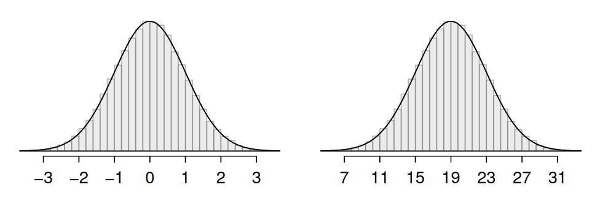


## Normal dağılım kuralı

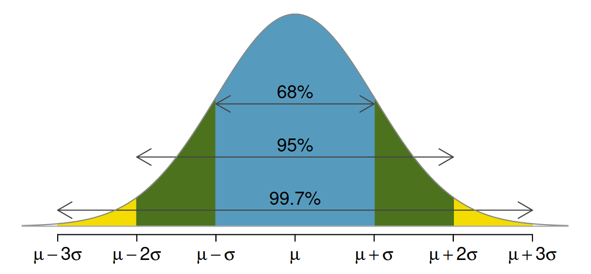

## Z skor

Ortalamaya kaç standard sapma uzak olunduğunu gösterir ve normal dağılım değerlerini standart hale getirir (~ -3,3)

$$ Z = \frac{x-\mu}{\sigma}  $$


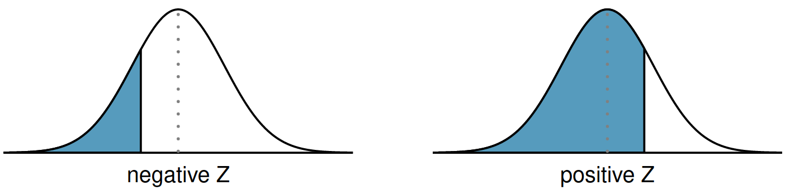


## Normal dağılım tablosu

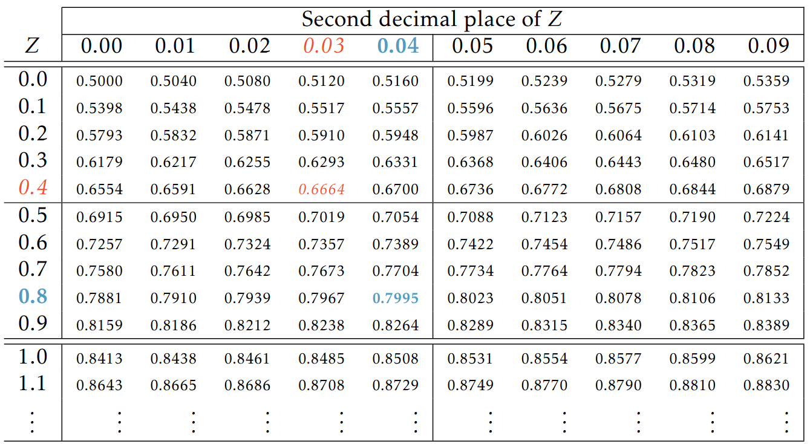

## {background-image="images/zscore_positive.png" background-size=contain}

## {background-image="images/zscore_negative.png" background-size=contain}


## Örnek

SAT skorları için ortalama 1500, standart sapma 300 iken 1800'den düşük puan alma ihtimali kaçtır? 1800 puan yüzde kaçlık dilime denk gelmektedir?

```{webr-r}
pnorm(q = 1800, 1500, 300)
```

Z-skor açısından

```{webr-r}
pnorm(q = 1, 0, 1)
```


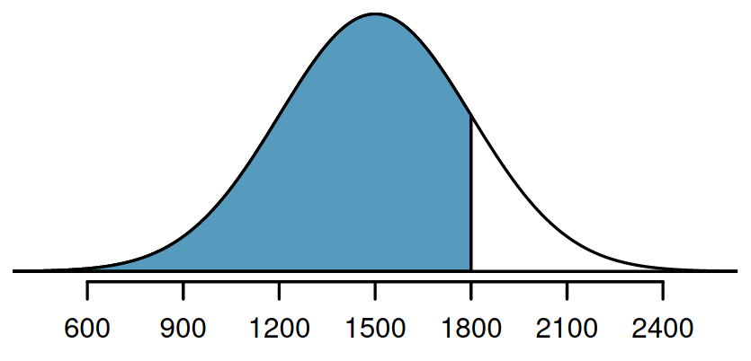{.nostretch fig-align="center" width="70%"}

## Örnek 2

Bir öğrencinin SAT skoru 1630'tan yüksek olma ihtimali nedir?

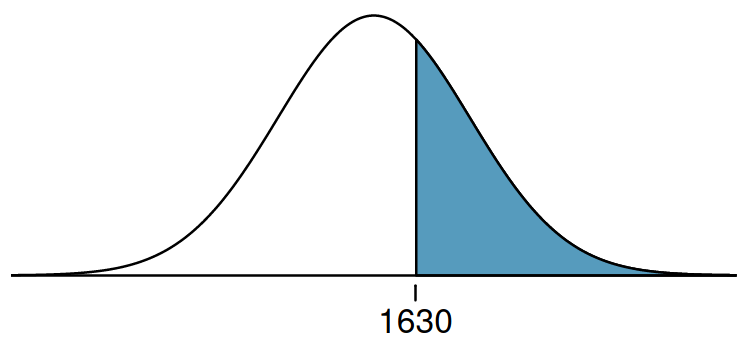{.nostretch fig-align="center" width="80%"}

```{webr-r}
pnorm(1630, 1500, 300)
1 - pnorm(1630, 1500, 300)
```


## 

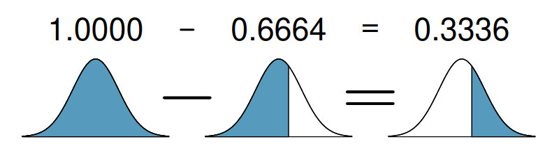


## Soru

20-62 yaş erkeklerin boy dağılımı ortalaması 70 inç ve standart sapması 3.3 inç iken, rastgele seçilen bir erkeğin boyunun 69 inç ve 74 inç arasında olması ihtimali nedir?

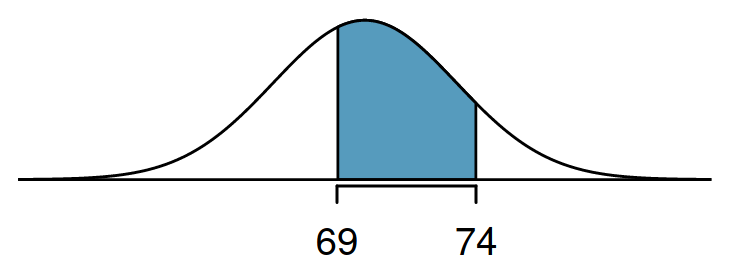{.nostretch fig-align="center" width="80%"}

```{webr-r}
# Çözümünüzü buraya yazıp çalıştırınız

```


## Soru

Boyu 40 yüzdelik dilimde olan bir kişinin boyu kaçtır?

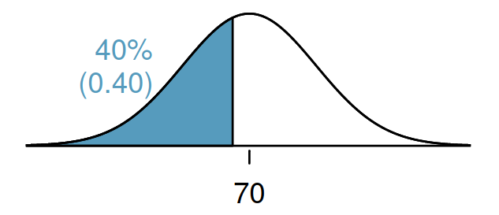{.nostretch fig-align="center" width="80%"}

```{webr-r}
qnorm(0.4, 70, 3.3)
```


## Poisson dağılımı

Poisson dağılımı, nadiren meydana gelen olayların, belirli bir zaman  aralığında veya belirli bir alanda kaç kere gerçekleşeceğini tahmin  etmek için kullanılan bir olasılık dağılımıdır.

Aşağıdaki grafik 8 milyon nüfuslu bir şehirde bir yıl boyunca hastaneye gelen günlük Akut Miyokard İnfarktüsü (AMI) vaka sayısını göstermektedir (ortalama=4.4 kişi) 

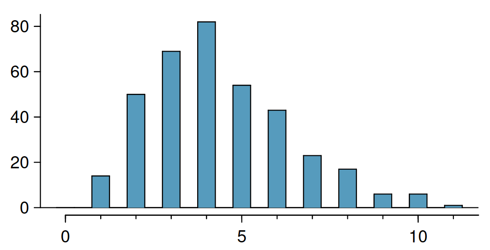{.nostretch fig-align="center" width="80%"}

## Örnekler {.scrollable}

Poisson dağılımı gösteren biyolojik veriler, genellikle nadir ve rastgele meydana gelen olaylara odaklanır. Bu tür veriler, çeşitli biyolojik disiplinler ve uygulama alanları üzerinden örneklerle açıklanabilir:

1. **Mikrobiyoloji ve Bakteriyoloji**:
   - **Bakteri Kolonilerinin Sayımı**: Petri kabında belirli bir süre ve koşullar altında büyüyen bakteri kolonilerinin sayımı. Örneğin, bir laboratuvar ortamında standart bir hacimdeki besiyeri üzerine ekilen bakteri spesifik bir zaman diliminde kaç koloni oluşturur.
   - **Virüs Titrelemeleri**: Bir hacimdeki virüs partikülleri sayısı. Bu, özellikle su örneklerinde veya biyolojik sıvılarda yapılan ölçümler için geçerlidir.

2. **Ekoloji ve Koruma Biyolojisi**:
   - **Ender Türlerin Birey Sayısı**: Belirli bir alandaki nadir görülen türlerin birey sayıları. Bu, büyük koruma alanlarında veya özel ekosistemlerde endemik türler için kullanılabilir.
   - **Parazit Sayımı**: Belirli bir konakçı popülasyonunda parazitlerin dağılımı. Örneğin, bir balık popülasyonunda bulunan parazit türlerinin sayısı.

3. **Moleküler Biyoloji ve Genetik**:
   - **DNA Mutasyonları**: Belirli bir gen uzunluğu boyunca meydana gelen mutasyonların sayısı. Özellikle büyük genomlar üzerinde nadiren meydana gelen olaylar için kullanılır.
   - **Transkripsiyonel Olaylar**: Belirli bir zaman diliminde hücrede meydana gelen mRNA transkripsiyon olaylarının sayısı.

4. **Halk Sağlığı ve Epidemiyoloji**:
   - **Nadir Hastalık Vakaları**: Bir bölgede belirli bir zaman diliminde görülen nadir hastalık vakalarının sayısı. Özellikle düşük prevalanslı hastalıklar için geçerlidir.
   - **Salgın Olayları**: Belirli bir zaman aralığında bir popülasyonda meydana gelen salgın hastalık vakalarının sayısı.

5. **Nörobilim ve Fizyoloji**:
   - **Nöronal Ateşleme Olayları**: Belirli bir zaman diliminde bir veya birden fazla nöronun ateşleme (aksiyon potansiyeli) olaylarının sayısı. Özellikle düşük ateşleme hızlarına sahip nöronlar için Poisson dağılımı uygulanabilir.
   - **Sinaptik Olaylar**: Sinapslarda meydana gelen nörotransmitter salınım olaylarının sayısı.

## Poisson dağılımı

```{webr-r}
# hist() fonskiyonu ile histogram görüntüleyiniz
rpois(n = 365, 4.4)
```


## Poisson fonksiyonu

*k* olay olma ihtimali

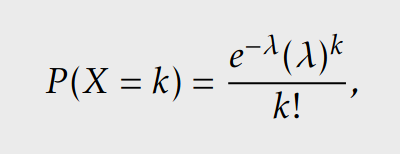{.nostretch fig-align="center" width="50%"}

*t* zaman içinde gerçekleşen *k* olay ihtimali

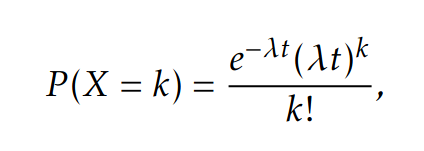{.nostretch fig-align="center" width="50%"}

## Örnek

* 7 gün içinde 2 hastanın AMI teşhisi ile hastanelik olma ihtimali nedir? ($\lambda$​=4.4, *k*=2, *t*=7) 

```{webr-r}
dpois(lambda = 30.8, x = 2)
```

* 7 gün içinde en fazla 2 kişinin hastanelik olması ihtimali nedir?

```{webr-r}
dpois(lambda = 30.8, x = 0) + dpois(lambda = 30.8, x = 1) + dpois(lambda = 30.8, x = 2)

# VEYA

ppois(q = 2, lambda = 30.8)
```

* En az 3 kişinin 7 gün içinde hastanelik olma ihtimali kaçtır?


## Bernoulli dağılımı

Bernoulli dağılımı, yalnızca iki sonuçtan (başarı veya başarısızlık,  evet veya hayır, 1 veya 0 gibi) birini alabilen rastgele bir deneyi  modellemek için kullanılan bir olasılık dağılımıdır. Binomial dağılımında *n* defa gerçekleşen, ikili sonucu olan olayların ihtimali hesaplanırken, Bernoulli dağılımında *k*=1'dir.

Madeni para atışı, hastalık testi sonucu, bitki tohumu çimlenmesi, ilaç tepkisi gibi örnekler Bernoulli dağılımı için örnek gösterilebilir.

Bernoulli dağılımının tekrarı ile sadece Binomial dağılım ortaya çıkmaz; geometrik, negatif binomial ve hipergeometrik dağılımlar Bernoulli dağılımı temel alır.


## Binomial dağılım

Binomial dağılım, bağımsız ve aynı olasılığa sahip *n* denemede tam olarak *k* başarı elde etme olasılığını hesaplamak için kullanılan bir olasılık dağılımıdır. Her deneme bir Bernoulli denemesidir (iki sonuç: başarı veya başarısızlık).

Aşağıdaki grafik 10 hastaya uygulanan bir tedavide yan etki görülme sayısının dağılımını göstermektedir (yan etki olasılığı p=0.3)

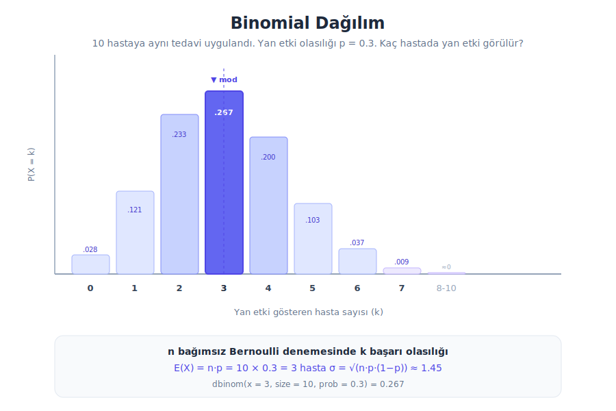{.nostretch fig-align="center" width="80%"}

## Örnekler {.scrollable}

Binomial dağılım, sabit sayıda bağımsız denemede başarı sayısını modellemek için kullanılır. Biyolojik ve biyomedikal araştırmalarda sıkça karşılaşılan örnekler:

1. **Genetik ve Popülasyon Genetiği**:
   - **Hardy-Weinberg Genotip Frekansları**: Bir popülasyonda belirli bir allelin 2n kromozomdan kaç tanesinde bulunacağı. Örneğin, heterozigot taşıyıcı sıklığının hesaplanması.
   - **SNP Allel Frekansları**: Bir örneklemdeki bireylerin kaç tanesinin belirli bir varyantı taşıdığı.

2. **Klinik Araştırmalar ve Farmakoloji**:
   - **Tedaviye Yanıt Oranları**: *n* hastadan kaç tanesinin tedaviye yanıt vereceği. Örneğin, 20 hastaya uygulanan bir kemoterapide tam yanıt gösteren hasta sayısı.
   - **Yan Etki İnsidansı**: Bir ilacın *n* hastada kaç tanesinde yan etki oluşturduğu.

3. **Mikrobiyoloji**:
   - **Antibiyotik Duyarlılık Testleri**: *n* bakteri izolatından kaç tanesinin belirli bir antibiyotiğe dirençli olduğu.
   - **Aşı Etkinliği**: Aşılanan *n* kişiden kaç tanesinin enfeksiyondan korunduğu.

4. **Epidemiyoloji**:
   - **Hastalık Prevalansı**: Rastgele seçilen *n* kişilik bir örneklemde kaç kişinin belirli bir hastalığa sahip olduğu.
   - **Tarama Testi Sonuçları**: *n* kişiye uygulanan tarama testinde kaç pozitif sonuç çıkacağı.

5. **Ekoloji**:
   - **Tohum Çimlenmesi**: Ekilen *n* tohumdan kaç tanesinin çimleneceği, her tohumun bağımsız ve aynı çimlenme olasılığına sahip olduğu varsayımıyla.

## Binomial dağılım

```{webr-r}
# n=10 deneme, p=0.3 başarı olasılığı ile 1000 simülasyon
x <- rbinom(n = 1000, size = 10, prob = 0.3)
hist(x, breaks = seq(-0.5, 10.5, 1), col = "steelblue",
     main = "Binomial Dağılım (n=10, p=0.3)",
     xlab = "Başarı sayısı", ylab = "Frekans")
```

## Binomial fonksiyonu

*n* denemede *k* başarı olma ihtimali

$$ P(X = k) = \binom{n}{k} p^k (1-p)^{n-k} $$

Beklenen değer (ortalama) ve varyans

$$ E(X) = np \qquad \text{Var}(X) = np(1-p) $$

Kombinasyon formülü

$$ \binom{n}{k} = \frac{n!}{k!(n-k)!} $$

## Örnek

* 10 hastaya bir tedavi uygulanıyor. Yan etki olasılığı p=0.3 iken, tam olarak 3 hastada yan etki görülme ihtimali nedir?

```{webr-r}
dbinom(x = 3, size = 10, prob = 0.3)
```

* 10 hastadan en fazla 2 tanesinde yan etki görülme ihtimali nedir?

```{webr-r}
dbinom(x = 0, size = 10, prob = 0.3) + dbinom(x = 1, size = 10, prob = 0.3) + dbinom(x = 2, size = 10, prob = 0.3)

# VEYA

pbinom(q = 2, size = 10, prob = 0.3)
```

* En az 5 hastada yan etki görülme ihtimali kaçtır?

```{webr-r}
1 - pbinom(q = 4, size = 10, prob = 0.3)
```

## Negatif binomial dağılım

Negatif binomial dağılım, bağımsız Bernoulli denemelerinde *r*. başarıya ulaşmak için gereken toplam deneme sayısını modelleyen bir olasılık dağılımıdır. Geometrik dağılımın genellemesidir: geometrik dağılımda r=1 iken, negatif binomial dağılımda r≥1'dir.

Aşağıdaki grafik bir klinik araştırmada tedaviye yanıt oranı p=0.3 iken, 3. yanıt veren hastayı bulmak için gereken toplam hasta sayısının dağılımını göstermektedir.

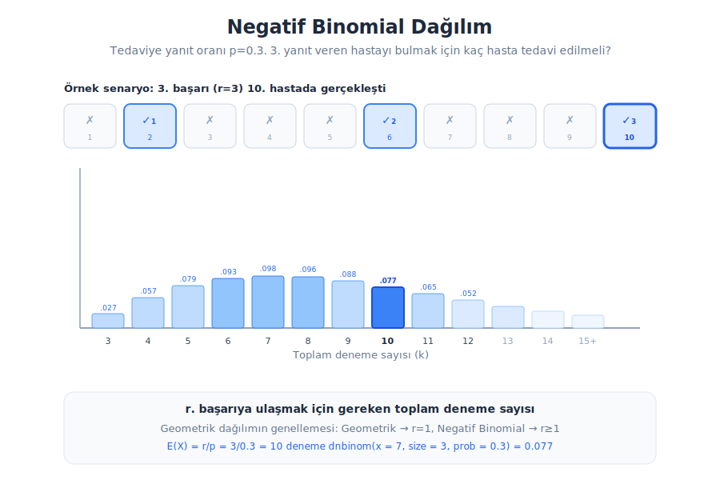{.nostretch fig-align="center" width="80%"}

## Örnekler {.scrollable}

Negatif binomial dağılım, belirli sayıda başarıya ulaşmak için gereken deneme sayısını veya aşırı dağılmış (overdispersed) sayım verilerini modellemek için kullanılır. Biyolojik araştırmalarda sıkça karşılaşılan örnekler:

1. **Klinik Araştırmalar**:
   - **Hasta Tarama Süreci**: Bir klinik çalışmaya dahil edilecek kriterleri karşılayan *r* hasta bulmak için kaç aday taranması gerektiği. Örneğin, nadir bir hastalığı olan 5 uygun hastayı bulmak için gereken tarama sayısı.
   - **Tedaviye Yanıt**: Belirli sayıda başarılı tedavi sonucu elde etmek için kaç hastanın tedavi edilmesi gerektiği.

2. **Genomik ve RNA-seq**:
   - **Gen Ekspresyon Sayımları**: RNA-seq verilerinde gen başına okunan read sayıları genellikle Poisson'dan daha fazla varyans gösterir (overdispersion). Negatif binomial dağılım bu fazla varyansı modellemek için standart yöntemdir. DESeq2 ve edgeR gibi yaygın araçlar negatif binomial model kullanır.

3. **Ekoloji**:
   - **Tür Zenginliği Örneklemesi**: Belirli sayıda nadir türü gözlemlemek için gereken örnekleme çabası. Örneğin, bir ekosistemde 3 farklı endemik kuş türünü gözlemlemek için yapılması gereken arazi çalışması sayısı.
   - **Parazit Yükü**: Konakçılar arasındaki parazit sayısı dağılımı genellikle Poisson'dan daha dağınıktır ve negatif binomial ile daha iyi modellenir.

4. **Epidemiyoloji**:
   - **Hastalık Kümelenmeleri**: Belirli bir bölgede hastalık vakalarının sayısı Poisson'dan daha fazla varyans gösterdiğinde (bazı bölgelerde kümelenme, bazılarında hiç vaka yokken) negatif binomial dağılım kullanılır.

5. **Kalite Kontrol ve Mikrobiyoloji**:
   - **Kontaminasyon Tespiti**: Üretim hattında *r*. kusurlu ürünü bulmak için kaç ürünün incelenmesi gerektiği.

## Negatif binomial dağılım

```{webr-r}
# r=3 başarı, p=0.3 başarı olasılığı ile 1000 simülasyon
# rnbinom başarıdan önceki BAŞARISIZLIK sayısını döner
x <- rnbinom(n = 1000, size = 3, prob = 0.3)
hist(x, col = "steelblue", breaks = 20,
     main = "Negatif Binomial Dağılım (r=3, p=0.3)",
     xlab = "Başarısızlık sayısı (3. başarıdan önce)", ylab = "Frekans")
```

## Negatif binomial fonksiyonu

*k*. denemede *r*. başarıyı elde etme ihtimali

$$ P(X = k) = \binom{k-1}{r-1} p^r (1-p)^{k-r} $$

Beklenen değer (ortalama) ve varyans

$$ E(X) = \frac{r}{p} \qquad \text{Var}(X) = \frac{r(1-p)}{p^2} $$

> **Not:** R'da `rnbinom` ve `dnbinom` fonksiyonları *r*. başarıdan **önceki başarısızlık sayısını** (*x* = k − r) kullanır; toplam deneme sayısını değil.

## Örnek

* Tedaviye yanıt oranı p=0.3 iken, 3. yanıt veren hastanın tam olarak 10. hasta olma ihtimali nedir? (yani 7 başarısızlık + 3. başarı)

```{webr-r}
dnbinom(x = 7, size = 3, prob = 0.3)
```

* 3 başarılı tedavi için en fazla 8 hasta tedavi etme ihtimali nedir? (yani en fazla 5 başarısızlık)

```{webr-r}
pnbinom(q = 5, size = 3, prob = 0.3)
```

* 3 başarılı tedavi için 15'ten fazla hasta tedavi etme ihtimali kaçtır? (yani 12'den fazla başarısızlık)

```{webr-r}
1 - pnbinom(q = 12, size = 3, prob = 0.3)
```

## Geometik dağılım {.scrollable}

Geometrik dağılım, bağımsız ve aynı şekilde dağılmış Bernoulli denemeleri serisinde, ilk başarının elde edilmesi için gereken deneme sayısını modelleyen bir olasılık dağılımıdır. Diğer bir deyişle, bir dizi denemede ilk başarıya ulaşana kadar yapılan deneme sayısının dağılımını tanımlar.

### Örnekler  

Geometrik dağılım, biyolojik süreçler ve fenomenler içinde çeşitli örneklerle temsil edilebilir. Bu tür dağılımlar, belirli bir olayın meydana gelmesi için gereken deneme sayısını veya bir başarı elde edene kadar geçen süreyi modellemek için özellikle uygun olabilir. İşte geometrik dağılımı kullanarak modelleyebileceğiniz biyolojik örnekler:

1. **Hastalığa Dirençli Bitki Bulma**: Bir araştırmacı, belirli bir hastalığa dirençli bir bitki çeşidi geliştirmek üzere rastgele mutasyonlar oluşturuyor. Her bir mutasyonun, istenilen direnci gösterme olasılığı düşük olabilir. Bu durumda, araştırmacının dirençli bir mutasyon elde etmesi için gereken deneme sayısı geometrik dağılımla modelleyebilir.
2. **Nadir Görülen Türlerin Tespiti**: Bir ekolog, nadir görülen bir türün üyelerini bulmak için rastgele örnekler alıyor. Her bir örnekleme denemesinde bu türden bir birey bulma şansı düşükse, bu tür bir bireyin ilk kez tespit edilmesi için gereken örnekleme sayısı geometrik dağılımla modelleyebilir.
3. **Antibiyotik Direnci**: Bir mikrobiyolog, bir bakteri popülasyonundan rastgele seçilen bir bakterinin belirli bir antibiyotiğe dirençli olup olmadığını test eder. Eğer popülasyon içinde dirençli bakterilerin oranı düşükse, ilk dirençli bakterinin tespit edilmesi için yapılması gereken test sayısı geometrik dağılımla ifade edilebilir.
5. **Genetik Çaprazlamalar**: Genetik bir özelliğin baskın olduğu durumda, belirli bir çaprazlama sonucunda istenilen genetik yapıya (örneğin, bir hastalığa karşı dirençli bir genotip) sahip bir yavru elde edilene kadar gereken çaprazlama sayısı. Her bir çaprazlamanın bağımsız ve sabit bir başarı şansı varsa, bu durum geometrik dağılımla modellenebilir.

## Geometrik dağılım

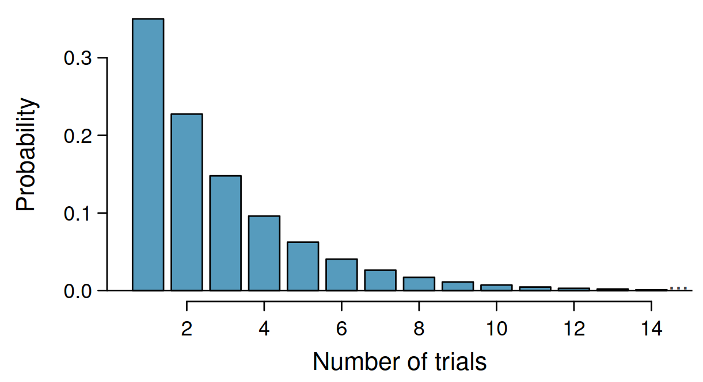{.nostretch fig-align="center" width="65%"}

Gerçekleşme ihtimali  *p*= 0.35 iken, ilk denemede başarılı olma ihtimali yine 0.35'tir. İkinci denemede başarılı olma ihtimali ise 0.65 x 0.35 = 0.228i'dir. Üçüncü denemede başarılı olma ihtimali ise 0.65 x 0.65 x 0.35 = 0.148'tir.

Geometric dağılımda olasılık üssel şekilde azalır.

## Geometrik dağılım

*k*. denemede ilk başarıyı elde etme ihtimali

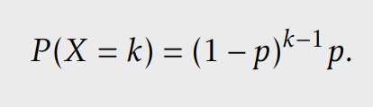{.nostretch fig-align="center" width="50%"}

Bekleme süresinin ortalaması, varyansı ve standard sapması

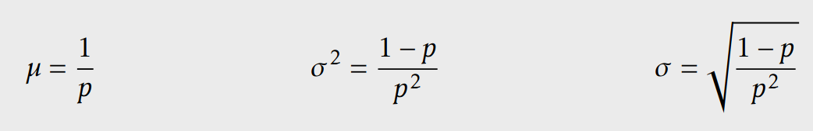{.nostretch fig-align="center" width="60%"}

## Geometrik dağılım - formüller

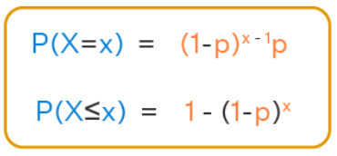{.nostretch fig-align="center" width="60%"}

## Soru

Başarının ilk 4 denemede gerçekleşme ihtimali kaçtır? 

*P*(*X*=1) + *P*(*X*=2) + *P*(*X*=3) + *P*(*X*=4) = 0.82

Başarının ilk 4 denemede gerçekleşmeme ihtimali kaçtır?

1- 0.82 = 0.18

> R'da geometrik fonksiyon "başarıdan öncde gerekli deneme sayısını" dikkate alır

```{webr-r}
pgeom(q = 3, prob = 0.35)
```
## Özet

* Normal dağılım (sürekli) → 
* Poisson (kesikli, nadir olaylar) 
* Bernoulli (yapı taşı) 
  * Bernoulli türevleri: Binomial (n kez tekrar) 
  * Geometrik (ilk başarıya kadar) 
  * Negatif Binomial (r. başarıya kadar, geometriğin genellemesi) 

* Hipergeometrik ("iadesiz çekiliş — Bernoulli'den farklı!") 
* Log-Normal (sürekli, biyolojik verilerde çok yaygın)

## Hipergeometrik dağılım

Hipergeometrik dağılım, sonlu bir popülasyondan **iadesiz** çekiliş yapıldığında, belirli bir özelliğe sahip bireylerin seçilme sayısını modelleyen bir olasılık dağılımıdır. Binomial dağılımdan farkı, her çekişte olasılığın değişmesidir çünkü çekilen birey geri konmaz.

Aşağıdaki grafik bir gen seti zenginleştirme analizini göstermektedir: 20.000 genlik genomdan rastgele 50 gen seçildiğinde, bunların kaç tanesinin kanser ilişkili 800 gen arasından geldiğini sorgulamaktadır.

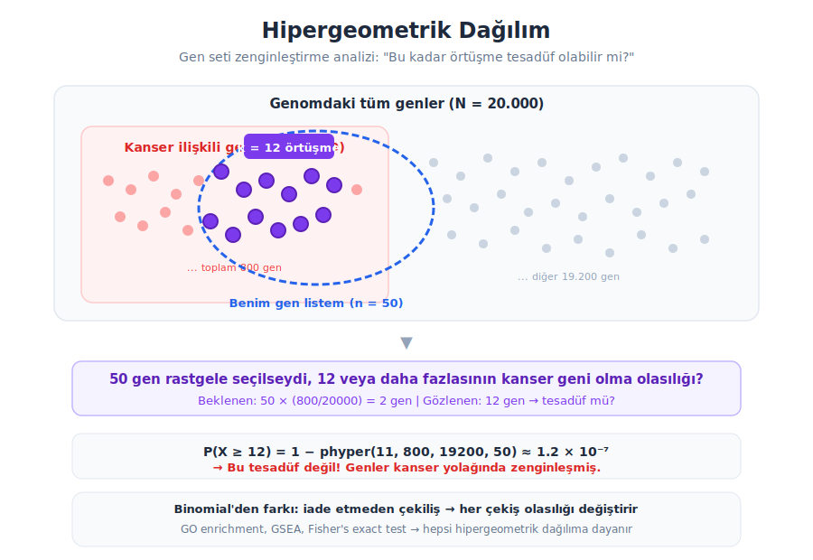{.nostretch fig-align="center" width="80%"}

## Örnekler {.scrollable}

Hipergeometrik dağılım, iadesiz örneklemde belirli bir kategoriden kaç birey seçileceğini modellemek için kullanılır. Biyolojik araştırmalarda yaygın kullanım alanları:

1. **Biyoinformatik ve Genomik**:
   - **Gen Ontolojisi (GO) Zenginleştirme Analizi**: Diferansiyel olarak ifade edilen gen listesinde belirli bir biyolojik yolağa ait genlerin beklenenden fazla olup olmadığının testi. Örneğin, 200 upregüle genin 15'inin apoptoz yolağında olması tesadüf mü?
   - **KEGG Pathway Analizi**: Bir gen listesindeki metabolik yolak zenginleştirmesinin istatistiksel anlamlılığı.

2. **Genetik ve Popülasyon Biyolojisi**:
   - **Fisher'ın Kesin Testi (Fisher's Exact Test)**: 2x2 kontenjans tablolarında beklenen frekanslar düşük olduğunda kullanılan test, hipergeometrik dağılıma dayanır.
   - **Genetik Sürüklenme Modelleri**: Küçük popülasyonlarda allel frekanslarının nesiller arası değişimi, iadesiz örnekleme olarak modellenebilir.

3. **Ekoloji**:
   - **Yakalama-Tekrar Yakalama Yöntemi**: Bir gölde 100 balık işaretlenip bırakıldıktan sonra, tekrar yakalanan 50 balıktan kaç tanesinin işaretli olduğu.
   - **Biyoçeşitlilik Örneklemesi**: Bir alandaki toplam türlerin bilinen bir alt kümesinin rastgele örneklemde temsil oranı.

4. **Klinik Araştırmalar**:
   - **Rastgele Hasta Seçimi**: 100 kişilik bir kohorttan (40 kadın, 60 erkek) 20 kişilik bir tedavi grubu oluşturulduğunda kadın sayısının dağılımı.

5. **Kalite Kontrol**:
   - **Lot Örneklemesi**: 500 ürünlük bir partiden 30 ürün kontrol edildiğinde, kusurlu ürün sayısının dağılımı.

## Hipergeometrik dağılım

```{webr-r}
# N=20000 gen, K=800 kanser geni, n=50 seçilen gen
# 1000 simülasyon: her seferinde 50 gen rastgele seçelim
x <- rhyper(nn = 1000, m = 800, n = 19200, k = 50)
hist(x, col = "steelblue", breaks = seq(-0.5, max(x)+0.5, 1),
     main = "Hipergeometrik Dağılım (N=20000, K=800, n=50)",
     xlab = "Kanser geni sayısı (50 gen içinde)", ylab = "Frekans")
abline(v = 50 * 800/20000, col = "red", lwd = 2, lty = 2)
text(50 * 800/20000 + 0.5, 200, "Beklenen = 2", col = "red", pos = 4)
```

## Hipergeometrik fonksiyonu

Popülasyondaki *N* bireyden *n* tanesini seçtiğimizde, *K* özel bireyin *k* tanesini çekme ihtimali

$$ P(X = k) = \frac{\binom{K}{k}\binom{N-K}{n-k}}{\binom{N}{n}} $$

Beklenen değer ve varyans

$$ E(X) = n\frac{K}{N} \qquad \text{Var}(X) = n\frac{K}{N}\frac{N-K}{N}\frac{N-n}{N-1} $$

> **Parametreler:** *N* = popülasyon büyüklüğü, *K* = popülasyondaki "başarı" sayısı, *n* = çekilen örneklem, *k* = örneklemdeki başarı sayısı

## Örnek

* 20.000 genlik genomda 800 tanesi kanser ilişkili. Rastgele 50 gen seçtiğimizde tam olarak 5 tanesinin kanser geni olma ihtimali nedir?

```{webr-r}
dhyper(x = 5, m = 800, n = 19200, k = 50)
```

* 50 genlik listede 12 veya daha fazla kanser geni bulunma ihtimali nedir? (zenginleştirme p-değeri)

```{webr-r}
# P(X >= 12) = 1 - P(X <= 11)
1 - phyper(q = 11, m = 800, n = 19200, k = 50)
```

* Fisher'ın kesin testi ile aynı sonucu elde edelim

```{webr-r}
# 2x2 tablo: 50 genlik liste vs 19950 diğer genler
#             kanser geni    diğer
# listede        12            38
# liste dışı    788         19162
fisher.test(matrix(c(12, 788, 38, 19162), nrow = 2))
```

## Log-normal dağılım

Log-normal dağılım, logaritması normal dağılım gösteren bir sürekli olasılık dağılımıdır. Değerler her zaman pozitiftir ve dağılım sağa çarpıktır. Biyolojide çarpımsal süreçlerle oluşan ölçümler (hücre bölünmesi, gen ekspresyonu, enzim aktivitesi) genellikle log-normal dağılım gösterir.

Aşağıdaki grafik gen ekspresyon seviyelerinin (FPKM) ham halini ve log dönüşümü sonrasını karşılaştırmaktadır.

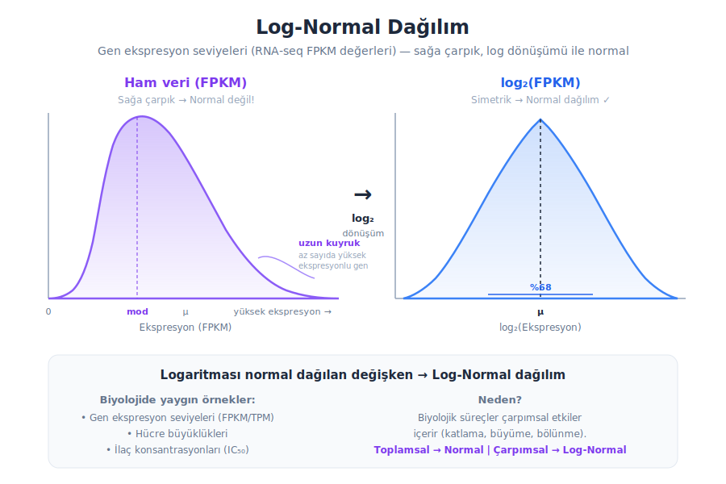{.nostretch fig-align="center" width="85%"}

## Örnekler {.scrollable}

Log-normal dağılım, değerleri sıfırın altına düşmeyen ve sağa çarpık olan biyolojik ölçümlerde yaygın olarak karşımıza çıkar:

1. **Genomik ve Transkriptomik**:
   - **Gen Ekspresyon Seviyeleri**: RNA-seq verilerinde FPKM/TPM/RPKM değerleri tipik olarak log-normal dağılım gösterir. Çoğu gen düşük seviyede ifade edilirken, az sayıda gen çok yüksek seviyede ifade edilir.
   - **Protein Konsantrasyonları**: Hücre içi protein miktarları genellikle log-normal dağılır.

2. **Farmakoloji ve Toksikoloji**:
   - **İlaç Konsantrasyonları (IC₅₀)**: Bir ilacın hücre büyümesini %50 inhibe eden konsantrasyonu bireyler arasında log-normal dağılım gösterir.
   - **Doz-Yanıt Eğrileri**: İlaç dozlarının etkisi genellikle logaritmik ölçekte analiz edilir.

3. **Hücre Biyolojisi**:
   - **Hücre Büyüklükleri**: Bir popülasyondaki hücrelerin çap veya hacim dağılımı. Hücreler büyüyüp bölündüğü için çarpımsal bir süreç söz konusudur.
   - **Hücre Bölünme Süreleri**: Hücrelerin bir bölünme döngüsünü tamamlama süreleri.

4. **Ekoloji ve Çevre Bilimleri**:
   - **Tür Bolluğu**: Bir ekosistemdeki türlerin birey sayıları — az sayıda tür çok baskınken, çoğu tür nadir bulunur.
   - **Çevresel Kirletici Konsantrasyonları**: Toprak veya sudaki ağır metal seviyeleri.

5. **Epidemiyoloji**:
   - **Kuluçka Süreleri**: Birçok enfeksiyon hastalığının kuluçka süresi log-normal dağılım gösterir.
   - **Antikor Titreleri**: Serolojik testlerde ölçülen antikor seviyeleri.

## Log-normal dağılım

```{webr-r}
# Log-normal dağılımdan 1000 örneklem (gen ekspresyonu simülasyonu)
set.seed(42)
x <- rlnorm(n = 1000, meanlog = 2, sdlog = 1.2)

par(mfrow = c(1, 2))

# Sol: Ham veri (sağa çarpık)
hist(x, col = "mediumpurple", breaks = 50,
     main = "Ham veri (FPKM)", xlab = "Ekspresyon", ylab = "Frekans")

# Sağ: Log dönüşümü (normal)
hist(log2(x), col = "steelblue", breaks = 30,
     main = "log₂ dönüşümü", xlab = "log₂(Ekspresyon)", ylab = "Frekans")

par(mfrow = c(1, 1))
```

## Log-normal fonksiyonu

$X$ log-normal dağılıyorsa $\ln(X)$ normal dağılır: $\ln(X) \sim N(\mu, \sigma^2)$

Olasılık yoğunluk fonksiyonu

$$ f(x) = \frac{1}{x \sigma \sqrt{2\pi}} \exp\left(-\frac{(\ln x - \mu)^2}{2\sigma^2}\right), \quad x > 0 $$

Beklenen değer ve varyans

$$ E(X) = e^{\mu + \sigma^2/2} \qquad \text{Var}(X) = e^{2\mu + \sigma^2}(e^{\sigma^2} - 1) $$

> **Neden log-normal?** Normal dağılım **toplamsal** rastgele etkilerin sonucudur (Merkezi Limit Teoremi). Log-normal dağılım ise **çarpımsal** rastgele etkilerin sonucudur. Biyolojide büyüme, katlama ve bölünme gibi süreçler çarpımsaldır.

## Örnek

* Gen ekspresyon verisinde (meanlog=2, sdlog=1.2) bir genin 50 FPKM'den düşük ifade edilme olasılığı nedir?

```{webr-r}
plnorm(q = 50, meanlog = 2, sdlog = 1.2)
```

* Ekspresyon değerlerinin %95'inin altında kalan eşik değer (FPKM) nedir?

```{webr-r}
qlnorm(p = 0.95, meanlog = 2, sdlog = 1.2)
```

* Normal dağılım varsayımını Shapiro-Wilk testi ile kontrol edelim

```{webr-r}
set.seed(42)
x <- rlnorm(1000, meanlog = 2, sdlog = 1.2)

# Ham veri normal mi?
shapiro.test(sample(x, 100))

# Log dönüşümü sonrası normal mi?
shapiro.test(sample(log(x), 100))
```
