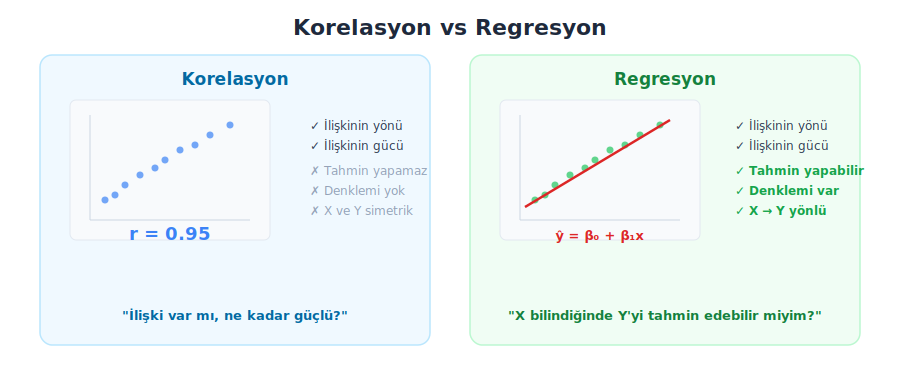
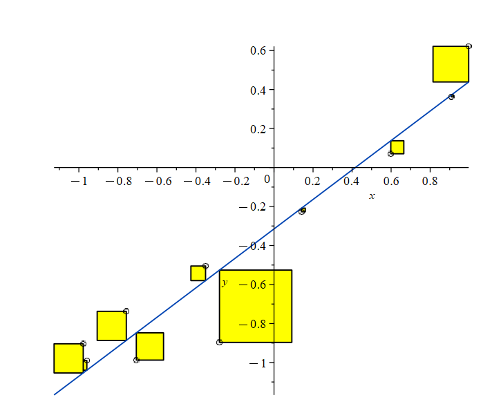

## Özet

* Regresyon nedir? Korelasyondan farkı
* Basit doğrusal regresyon
* En küçük kareler yöntemi (OLS)
* Regresyon katsayılarının yorumlanması
* R² — Belirtme katsayısı
* Regresyon varsayımları (LINE)
* Artıkların incelenmesi
* Tahmin (prediction)
* Çoklu regresyon
* Biyolojik örnekler ve R uygulamaları

## Korelasyon vs Regresyon

{.nostretch fig-align="center" width="100%"}

## Regresyon nedir?

Regresyon, bir **bağımlı değişken** (Y) ile bir veya daha fazla **bağımsız değişken** (X) arasındaki ilişkiyi matematiksel bir modelle ifade eden istatistiksel bir yöntemdir.

* **Korelasyon**: "Boy ve kilo arasında ilişki var mı?" → r = 0.95
* **Regresyon**: "Boyu 175 cm olan birinin kilosu kaç olur?" → ŷ = −105 + 1.1 × 175 = 87.5 kg

Regresyon **yönlü** bir analizdir: X'ten Y'yi tahmin ederiz. X ve Y'nin yerini değiştirirsek farklı bir denklem elde ederiz.

## Basit doğrusal regresyon

Tek bir bağımsız değişken (X) ile bağımlı değişken (Y) arasındaki doğrusal ilişkiyi modellemek için kullanılır.

$$ Y = \beta_0 + \beta_1 X + \varepsilon $$

* $\beta_0$ : kesim noktası (intercept) — X = 0 olduğunda Y'nin tahmini değeri
* $\beta_1$ : eğim (slope) — X'teki 1 birimlik artışın Y'de oluşturduğu değişim
* $\varepsilon$ : hata terimi (error) — modelin açıklayamadığı rastgele varyasyon

Tahmin denklemi (şapka = tahmin):

$$ \hat{Y} = \hat{\beta}_0 + \hat{\beta}_1 X $$

## En küçük kareler yöntemi (OLS)

{.nostretch fig-align="center" width="60%"}

:::footer
kaynak: [OntarioTech](https://nool.ontariotechu.ca/mathematics/basic/points-and-graphs/least-squares-trendline-and-correlation.php)
:::

## OLS formülleri

Eğim ($\hat{\beta}_1$) ve kesim noktası ($\hat{\beta}_0$) hesabı:

$$ \hat{\beta}_1 = \frac{\sum_{i=1}^n (x_i - \bar{x})(y_i - \bar{y})}{\sum_{i=1}^n (x_i - \bar{x})^2} $$

$$ \hat{\beta}_0 = \bar{y} - \hat{\beta}_1 \bar{x} $$

> Regresyon doğrusu her zaman $(\bar{x}, \bar{y})$ noktasından geçer.

## Basit doğrusal regresyon — R uygulaması

```{webr-r}
# Kedilerde vücut ağırlığı (kg) vs kalp ağırlığı (g)
library(MASS)
data(cats)

# Regresyon modeli,
# tilda işareti = Hwt, Bwt'ye bağlı
# tilda işareti, AltGr + ü
model <- lm(Hwt ~ Bwt, data = cats)
summary(model)
```

## Katsayıların yorumlanması {.scrollable}

`summary()` çıktısını yorumlayalım:

* **Intercept (β₀)**: Vücut ağırlığı 0 kg olsaydı kalp ağırlığının tahmini değeri. Biyolojik olarak anlamsızdır ama matematiksel olarak doğrunun Y eksenini kestiği noktadır.
* **Bwt (β₁)**: Vücut ağırlığındaki **1 kg'lık** artış, kalp ağırlığında ortalama **β₁ gram** artışa karşılık gelir.
* **p-value**: Eğimin sıfırdan farklı olup olmadığının testi. p < 0.05 ise X ile Y arasında istatistiksel olarak anlamlı bir doğrusal ilişki vardır.
* **Std. Error**: Katsayı tahmininin standart hatası. Küçük olması, tahminin kesin olduğunu gösterir.

Hesaplanan katsayılara göre, formül:

**Hwt = 4.034 x Bwt - 0.356 **

## Regresyon — görselleştirme

```{webr-r}
library(MASS)
data(cats)
model <- lm(Hwt ~ Bwt, data = cats)

plot(cats$Bwt, cats$Hwt, pch = 19, col = "steelblue",
     xlab = "Vücut Ağırlığı (kg)", ylab = "Kalp Ağırlığı (g)",
     main = "Kedilerde Basit Doğrusal Regresyon")
abline(model, col = "red", lwd = 2)
```

## R² — Belirtme katsayısı

$R^2$ (R-kare), bağımlı değişkendeki toplam varyansın yüzde kaçının model tarafından açıklandığını gösterir.

$$ R^2 = 1 - \frac{SS_{res}}{SS_{tot}} = 1 - \frac{\sum(y_i - \hat{y}_i)^2}{\sum(y_i - \bar{y})^2} $$

* $R^2 = 0$: Model hiçbir varyansı açıklamıyor (rastgele tahmin kadar kötü)
* $R^2 = 1$: Model tüm varyansı açıklıyor (tüm noktalar doğru üzerinde)
* Basit regresyonda (tek bağımsız değişken) $R^2 = r^2$ (Pearson korelasyonunun karesi)

```{webr-r}
model <- lm(Hwt ~ Bwt, data = cats)
summary(model)$r.squared

# Pearson r ile karşılaştır
cor(cats$Bwt, cats$Hwt)^2
```

## Regresyon varsayımları

4 temel varsayım (**LINE**)

- **L**inearity (doğrusallık): X ile Y arasındaki ilişki doğrusal olmalıdır. Eğrisel bir ilişki varsa (parabolik, logaritmik gibi) doğrusal regresyon modeli bu ilişkiyi doğru temsil edemez. Kontrol: Artık vs tahmin grafiğinde rastgele dağılım olmalı, U veya S şekli olmamalı.
- **I**ndependence (bağımsızlık): Gözlemler birbirinden bağımsız olmalıdır. Bir gözlemin değeri diğerini etkilememeli. Örneğin aynı hastadan tekrarlı ölçümler alındıysa bu varsayım ihlal edilir. 
- **N**ormality (normallik): Artıklar (residuals) normal dağılmalıdır. Y'nin kendisinin değil, modelin hatalarının normal dağılması gerekir. Kontrol: Q-Q grafiğinde noktalar çapraz çizgi üzerinde olmalı.
- **E**qual variance (eşit varyans): Artıkların varyansı tüm X değerlerinde sabit olmalıdır. Yani model düşük X değerlerinde de yüksek X değerlerinde de aynı miktarda hata yapmalı. Kontrol: Artık vs tahmin grafiğinde huni şekli (yelpaze açılması) olmamalı. 


## Varsayımları kontrol etme — R ile

```{webr-r}
library(MASS)
model <- lm(Hwt ~ Bwt, data = cats)

# R tarafından hazırlanan diagnostik grafikleri (sadece 1. ve 2. grafikleri çizelim)
# 2. grafiği siz çiziniz
plot(model, which = c(1))
```

## Diagnostik grafiklerin yorumlanması {.scrollable}

R'ın `plot(model)` komutu 4 diagnostik grafik üretir, biz sadece ikisine bakıyoruz:

1. **Residuals vs Fitted**: Artıklar ile tahmin değerleri. Rastgele dağılım olmalı, bir desen (eğri, huni) varsa varsayım ihlali var demektir.

2. **Normal Q-Q**: Artıkların normalliği. Noktalar çapraz çizgi üzerinde olmalı. Uçlarda sapma varsa normallik ihlali var demektir.

**Scale-Location** varyans eşitliğini, **Residuals vs Leverage** grafiği de modele orantısız etkileyen noktaları gösterir.

## "Kötü" örnekler

Residual-Fit veya QQ grafiği güzel olmayan iki örnek yapalım

- `trees` adlı veride ağaçlara ait yükseklik, çap ve hacim hesaplamaları var. hacim ile çap arasında silindir hacmi ilişkisi olduğundan residual-fit eğrisinde bir örüntü ortaya çıkacaktır
- kendimizin oluşturduğu enzim kinetiği verisinde doğrusal olmayan bir ilişki varken, doğrusal regresyon modelleme yaptığımızda residual-fit grafiğinde örüntü oluşacak ve QQ grafiğinde sapmalar olacaktır

## _trees_ veri seti

```{webr-r}
head(trees)
```

## Kotü model 1

```{webr-r}
model_kotu <- lm(Volume ~ Girth, data = trees)
# daha iyi model lm(Volume ~ poly(Girth, 2))

par(mfrow = c(1, 2))
plot(model_kotu, which = c(1, 2))
par(mfrow = c(1, 1))
```
## Kotü model 2

Michaelis-Menten benzeri doz-yanıt verisi

```{webr-r}
set.seed(42)
doz <- seq(0.5, 50, length = 40)
yanit <- (100 * doz) / (10 + doz) + rnorm(40, 0, 3)

plot(doz, yanit)
```

##

```{webr-r}
model_kotu2 <- lm(yanit ~ doz)

par(mfrow = c(1, 2))
plot(model_kotu2, which = c(1, 2))
par(mfrow = c(1, 1))
```
## 

```{webr-r}
plot(doz, yanit, pch = 19, col = "steelblue",
     xlab = "Substrat konsantrasyonu", 
     ylab = "Reaksiyon hızı",
     main = "Enzim kinetiği (Michaelis-Menten)")
abline(model_kotu2, col = "red", lwd = 2)
```

## Regresyon ile tahmin

```{webr-r}
library(MASS)
model <- lm(Hwt ~ Bwt, data = cats)

# Vücut ağırlığı 3.0 kg olan bir kedinin kalp ağırlığı tahmini
yeni_veri <- data.frame(Bwt = 3.0)

# nokta tahmin
predict(model, newdata = yeni_veri)
```

## Çoklu doğrusal regresyon

Birden fazla bağımsız değişken ile Y'yi modelleme:

$$ Y = \beta_0 + \beta_1 X_1 + \beta_2 X_2 + \cdots + \beta_p X_p + \varepsilon $$

Her $\beta_j$: diğer değişkenler sabit tutulduğunda, $X_j$'deki 1 birimlik artışın Y'deki etkisi.

**Düzeltilmiş R² (Adjusted R²)**: Çoklu regresyonda her yeni değişken R²'yi şişirir. Adjusted R² gereksiz değişkenleri cezalandırır:

$$ R^2_{adj} = 1 - \frac{(1-R^2)(n-1)}{n-p-1} $$

## Çoklu regresyon — R uygulaması

```{webr-r}
# Arabaların yakıt tüketimini etkileyen faktörler
data(mtcars)

# Basit model (sadece ağırlık)
model1 <- lm(mpg ~ wt, data = mtcars)

# Çoklu model (ağırlık + beygir gücü + silindir sayısı)
model2 <- lm(mpg ~ wt + hp + cyl, data = mtcars)

# Karşılaştır: 0.74 → 0.83 belirgin iyileşme
summary(model1)$adj.r.squared
summary(model2)$adj.r.squared
```

## Çoklu regresyon — model detayları

```{webr-r}
data(mtcars)
model2 <- lm(mpg ~ wt + hp + cyl, data = mtcars)
summary(model2)
```

Yani;

$$\text{mpg} = -3.16 \times \text{wt} - 0.01 \times \text{hp} - 0.94 \times \text{cyl} + 38.75$$
