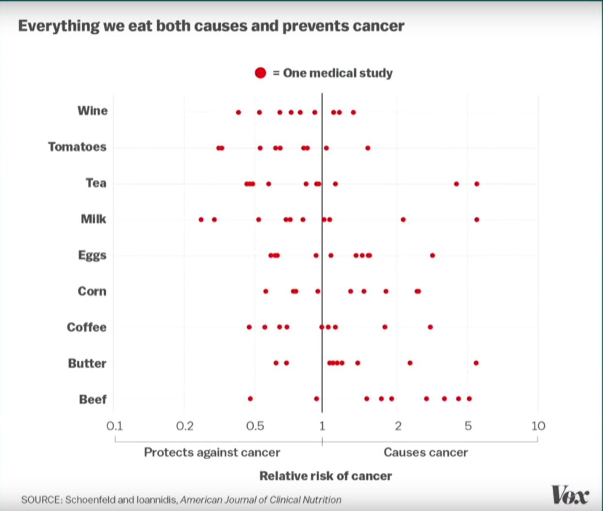
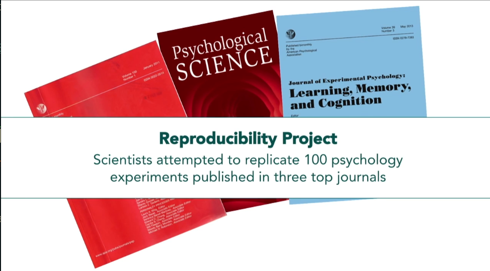
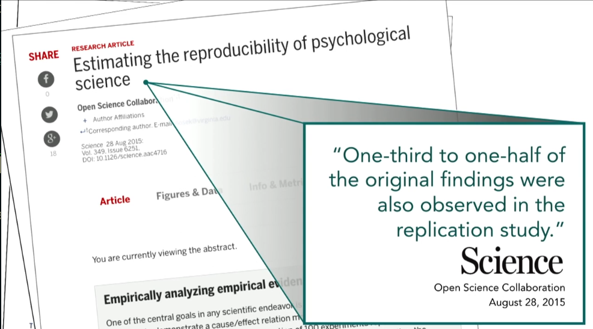

## Bir soru ile başlayalım

> "Yayınlanan bilimsel çalışmaların çoğu yanlış."


* Komplo teorisi mi?
* Bilime saldırı mı?
* Yoksa istatistiğin kaçınılmaz bir sonucu mu?

Bu derste iki video izleyeceğiz ve istatistiğin bilimde nasıl yanlış kullanılabileceğini — ve bunun nasıl düzeltilebileceğini — tartışacağız.

## Video 1: 

**Is Most Published Research Wrong?**: Veritasium kanalının bu videosu, yayınlanan araştırmaların neden güvenilmez olabileceğini anlatıyor.



## P-değeri eşiği: Eski bir standart

Bilim insanları bir sonucun "anlamlı" olup olmadığına **p-değeri** ile karar veriyor.

* p < 0.05 eşiği: "Bu sonuç şans eseri olma olasılığı %5'ten az" demek
* Bu eşik 1925'te **keyfi olarak** seçildi — sihirli bir sayı değil
* Çoğu insan "yayınlanan çalışmaların sadece %5'i yanlıştır" diye düşünüyor — ama gerçek oran çok daha yüksek

## Matematik: Neden bu kadar çok yanlış sonuç? {.scrollable}

Bir alanda 1.000 hipotez test edildiğini düşünelim. Bunların sadece %10'u (100 tanesi) gerçekten doğru olsun:

**Doğru hipotezler (100):** İstatistiksel güç %80 ise → **80 tanesi doğru şekilde bulunur**, 20 tanesi kaçırılır (Tip II hata)

**Yanlış hipotezler (900):** α = 0.05 ise → 900 × 0.05 = **45 tanesi yanlışlıkla "anlamlı" çıkar** (Tip I hata)

Yayınlanan sonuçlar: 80 gerçek + 45 yanlış pozitif = 125 çalışma

$$ \text{Yanlış sonuç oranı} = \frac{45}{125} = \%36 $$

Yani her şey **düzgün çalışsa bile**, yayınlanan sonuçların yaklaşık **üçte biri yanlış**.

Gerçek dünyada istatistiksel güç genellikle %20-40 arasında — bu durumda oran çok daha kötü.

## Soru

Gerçek dünyada istatistiksel güç ortalama olarak %30 ise, bir önceki slaytta yapılan *Yanlış Sonuç Oranı*'nı tekrar hesaplayın.


## P-hacking: Veriyi sonuç çıkana kadar ezmek

2015'te bir gazeteci, p-hacking'in ne kadar kolay olduğunu göstermek için sahte bir çalışma yayınladı: **"Bitter çikolata kilo verdirir."**

* Küçük bir örneklem (15 kişi) üzerinde **18 farklı sağlık ölçümü** takip etti
* 18 test yapınca, tesadüfen birinin p < 0.05 çıkma olasılığı: 1 − (0.95)^18 = **%60**
* Kilo kaybı "anlamlı" çıktı → dünya basınında manşet oldu
* Çalışma tamamen sahte ve tasarlanmıştı

## P-hacking nasıl yapılır?

Araştırmacı p < 0.05 bulana kadar veriyi farklı şekillerde analiz eder:

* Bir trend görünene kadar veri toplamaya devam etmek, sonra durmak
* Aykırı değerleri çıkarıp çıkarmamaya **sonuca göre** karar vermek
* Rastgele kontrol değişkenleri ekleyip çıkararak istenen p'yi aramak
* Alt grup analizleri yaparak birinde p < 0.05 aramak

Bunların çoğu bilinçli yapılmaz — araştırmacı "doğru" analizi aradığını düşünür ama aslında Tip I hata oranını kontrol edilemez şekilde artırır.

## Altıncı his deneyi

Bir araştırmacı "insanların geleceği hissedebileceğini" gösteren istatistiksel olarak anlamlı sonuçlar yayınladı. Metodolojik olarak sorunsuz görünüyordu.

Ama bir başka ekip aynı deneyi tekrarladığında sonucu doğrulayamadı. Tekrarlama çalışmasını yayınlamak istediğinde, **orijinal dergi bunu reddetti** — çünkü dergiler tekrarlama çalışmalarına ilgi duymuyor.

Bu, sistemin nasıl bozuk çalıştığını gösteriyor: yanlış bir sonuç yayınlanıyor, düzeltme yayınlanamıyor.

## Aynı veri, farklı sonuçlar

"Siyahi futbolcular daha mı çok kırmızı kart görüyor?" sorusu **29 farklı araştırma grubuna** soruldu. Hepsi aynı veriyi kullandı:

* 8 grup: "Eşit olasılıklı"
* 19 grup: "Daha olası"
* 2 grup: "3 kat daha olası"

Araştırmacının seçtiği istatistiksel yöntem, kontrol değişkenleri ve modelleme kararları sonucu tamamen değiştirebiliyor.

## Bozuk teşvik sistemi

Bilim kendi kendini düzeltmeli ama sistemin teşvikleri buna karşı çalışıyor:

* **"Yayınla ya da yok ol"**: Kariyer tamamen yayın sayısına bağlı → araştırmacılar "anlamlı" sonuç bulmaya zorlanıyor
* **Dergiler yenilik istiyor**: "İlginç" ve "beklenmedik" sonuçlar yayınlanır, tekrarlama çalışmaları ve negatif sonuçlar reddedilir
* 53 önemli kanser çalışmasından sadece **6 tanesi** tekrarlanabildi (%11)

## Umut var mı?

Son yıllarda bilim camiası bu sorunları çözmek için önemli adımlar atıyor:

* **Pre-registration**: Çalışma planı veri toplanmadan **önce** kaydediliyor → p-hacking'i önlüyor
* **Retraction Watch**: Geri çekilen çalışmaları takip eden platform
* **Açık veri ve kod paylaşımı**: Başkalarının sonuçları doğrulamasını mümkün kılıyor
* **Büyük ölçekli tekrarlama projeleri**: Psikoloji, kanser biyolojisi gibi alanlarda sistematik tekrarlama çalışmaları

Bilimsel yöntem matematiksel olarak kusurlu ve insan yanlılığına açık — ama yine de gerçeğe ulaşmak için elimizdeki en güvenilir araç.

## P-hacking simülasyonu

20 grup oluşturalım (hepsi aynı dağılımdan, aralarında hiçbir fark yok) ve t.test ile karşılaştıralım:

```{webr-r}
# 20 rastgele grup (hiçbir gerçek fark yok!)
set.seed(9)
gruplar <- list()
for(i in 1:20) gruplar[[i]] <- rnorm(30, mean = 100, sd = 15)

# Tüm çiftleri t.test ile karşılaştır: 190 test
p_degerleri <- c()
ciftler <- c()
for(i in 1:19) {
  for(j in (i+1):20) {
    p <- t.test(gruplar[[i]], gruplar[[j]])$p.value
    p_degerleri <- c(p_degerleri, p)
    if(p < 0.05) ciftler <- c(ciftler,
      paste("Grup", i, "vs Grup", j, "-> p =", round(p, 4)))
  }
}

```

##


```{webr-r}
cat("Toplam test sayısı:", length(p_degerleri), "\n")
cat("p < 0.05 olan test sayısı:", sum(p_degerleri < 0.05), "\n\n")
cat("'Anlamli' bulunan karsilastirmalar:\n")
```

```{webr-r}
ciftler
```
## P-hacking simülasyonu — görselleştirme

```{webr-r}
set.seed(9)
gruplar <- list()
for(i in 1:20) gruplar[[i]] <- rnorm(30, mean = 100, sd = 15)

p_degerleri <- c()
for(i in 1:19) {
  for(j in (i+1):20) {
    p <- t.test(gruplar[[i]], gruplar[[j]])$p.value
    p_degerleri <- c(p_degerleri, p)
  }
}
```

##


```{webr-r}
hist(p_degerleri, breaks = 20, col = "steelblue",
     main = "190 t-testin p-degeri dagilimi\n(gruplar arasi hicbir gercek fark yok!)",
     xlab = "p-degeri", ylab = "Frekans")
abline(v = 0.05, col = "red", lwd = 2, lty = 2)
text(0.08, max(hist(p_degerleri, breaks = 20, plot = FALSE)$counts),
     "alpha = 0.05", col = "red", pos = 4, cex = 0.9)
```

## Çoklu test problemi

190 t-testi yaptığınızda, **hiçbir gerçek fark olmasa bile** beklenen yanlış pozitif sayısı:

$$ 190 \times 0.05 = 9.5 \text{ "anlamlı" sonuç} $$

Araştırmacı bu 9-10 "anlamlı" sonuçtan birini seçip yayınlarsa → p-hacking.

##

**Çözüm: Çoklu test düzeltmesi**

* **Bonferroni**: α' = α / test sayısı = 0.05 / 190 = 0.00026
* **FDR (Benjamini-Hochberg)**: Yanlış keşif oranını kontrol eder

```{webr-r}
set.seed(9)
gruplar <- list()
for(i in 1:20) gruplar[[i]] <- rnorm(30, mean = 100, sd = 15)
p_degerleri <- c()
for(i in 1:19) for(j in (i+1):20) {
  p_degerleri <- c(p_degerleri, t.test(gruplar[[i]], gruplar[[j]])$p.value)
}

cat("Duzeltme oncesi 'anlamli':", sum(p_degerleri < 0.05), "\n")
cat("Bonferroni sonrasi 'anlamli':", sum(p.adjust(p_degerleri, "bonferroni") < 0.05), "\n")
cat("FDR sonrasi 'anlamli':", sum(p.adjust(p_degerleri, "fdr") < 0.05), "\n")
```

## Tekrarlanabilirlik krizi — rakamlarla {.scrollable}

Bilimde tekrarlanabilirlik sorunu geniş çaplı çalışmalarla belgelenmiştir:

| Alan | Çalışma | Tekrarlanan | Oran |
|:---|:---|:---|:---|
| Psikoloji | 100 çalışma | 39 | %39 |
| Kanser biyolojisi | 53 çalışma | 6 | %11 |
| İlaç keşfi (Bayer) | 67 proje | 14 | %21 |
| Ekonomi | 18 çalışma | 11 | %61 |

Bu bir "bilim bozuk" demek değil — bilimin kendi kendini düzeltme mekanizmasının çalıştığını gösteriyor. Ama sorunun farkında olmamız gerekiyor.

## Video 2: 

"A New Study Shows...": Laura Arnold'ın TED konuşması, medyanın bilimsel çalışmaları nasıl yanlış aktardığını ve "yeni bir çalışmaya göre..." cümlesinin neden tehlikeli olduğunu anlatıyor.



## Video 2 — Temel mesajlar {.scrollable}

**1. Power posing çalışması**

Amy Cuddy'nin ünlü "güç pozu" çalışması: 2 dakika güç pozu yapmak testosteron artırır ve stres azaltır. Milyonlarca kez izlendi — ama tekrar çalışmalarında sonuçlar doğrulanamadı. Orijinal çalışmanın yazarlarından biri bile çalışmayı reddettiğini açıkladı.

**2. Beslenme çalışmalarının sorunları**

* Küçük örneklem büyüklükleri (n = 20-30)
* Yanlış metodoloji (gözlemsel çalışmadan nedensellik çıkarma)
* Seçici raporlama (olumlu sonuçları yayınla, olumsuzları çekmeceye koy)
* Sonuç: "Her şey kansere neden oluyor" başlıkları

**3. File drawer effect (çekmece etkisi)**

Negatif sonuçlar (p > 0.05) yayınlanmaz. Yayınlanan literatür sadece "pozitif" sonuçları gösterir → gerçekliğin çarpıtılmış bir resmi.

10 grup aynı ilacı test eder → 1 grupta tesadüfen p < 0.05 çıkar → sadece o yayınlanır → "ilaç etkili" görünür.

## File drawer effect



## Tekrarlanabilirlik çalışması



##



## Ne yapabiliriz? {.scrollable}

Bireysel araştırmacı olarak:

1. **Çalışmayı önceden kaydet (pre-registration)**: Hipotezi ve analiz planını veri toplamadan önce yayınla → p-hacking'i önler
2. **Güç analizi yap**: Çalışmaya başlamadan önce yeterli örneklem büyüklüğünü hesapla
3. **Çoklu test düzeltmesi uygula**: Birden fazla test yapıyorsan Bonferroni veya FDR kullan
4. **Etki büyüklüğünü raporla**: Sadece p-değeri değil, etkinin büyüklüğünü de göster
5. **Veri ve kodu paylaş**: Başkalarının çalışmayı tekrarlamasını mümkün kıl
6. **Negatif sonuçları da yayınla**: Her sonuç bilgi içerir

Okuyucu / tüketici olarak:

1. "Yeni bir çalışmaya göre..." gördüğünüzde sorgulayın
2. Örneklem büyüklüğünü kontrol edin
3. Tek bir çalışmaya değil, çalışmaların bütününe bakın (meta-analiz)
4. Korelasyon ≠ nedensellik (bu dersten hatırlayın!)

## Kaynaklar {.scrollable}

**Makaleler:**

* Ioannidis, J.P.A. (2005). [Why Most Published Research Findings Are False](https://journals.plos.org/plosmedicine/article?id=10.1371/journal.pmed.0020124). PLoS Medicine.

**Videolar ve interaktif kaynaklar:**

* [Understanding the p-value — Statistics Help](https://www.youtube.com/watch?v=eyknGvncKLw)
* [Science Isn't Broken — FiveThirtyEight](https://fivethirtyeight.com/features/science-isnt-broken/#part1) (interaktif p-hacking simülasyonu)
* [I Fooled Millions Into Thinking Chocolate Helps Weight Loss](https://io9.gizmodo.com/i-fooled-millions-into-thinking-chocolate-helps-weight-1707251800)

**Bu dersin bağlantıları:**

* P-hacking → Tip I hata oranını kontrol edilemez şekilde artırır
* File drawer effect → Yayın yanlılığı → meta-analizler bile çarpık olabilir
* Küçük örneklem → Düşük istatistiksel güç → Hem Tip I hem Tip II hata artar
